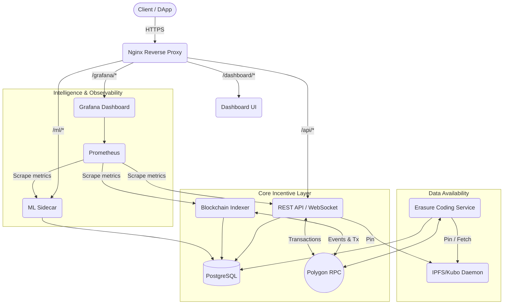

# Kyneto Protocol Architecture

Kyneto is a decentralized, blockchain-incentivized storage protocol built on top of IPFS (Kubo) and the Polygon network. It brings economic accountability, enterprise-grade fault tolerance, and predictive intelligence to decentralized storage.

This document details the complete end-to-end architecture and the various services that power the Kyneto network.

---

## High-Level Diagram

---

## The 7 Layers of Kyneto

### 1. Frontend & Routing Layer (Nginx)
Nginx acts as the unified gateway for all incoming traffic, handling SSL termination (via Let's Encrypt / Certbot) and routing requests to the appropriate Docker services. This allows all services to run securely behind a single firewall over standard port 443.

### 2. Storage Layer (IPFS/Kubo)
The foundational data layer. Kyneto does not modify the core Kubo daemon. Instead, it utilizes Kubo's HTTP API (`/api/v0`) to pin data, fetch content, and distribute files across the global IPFS swarm.

### 3. Backend Incentive Layer (REST API & Postgres)
Located in `incentive-layer/api/rest-api/src/server.ts`, this Node.js/Express service manages the business logic:
- **Provider Registration:** Linking Ethereum addresses to IPFS Peer IDs. Requires EIP-191 signature proof.
- **Deal Management:** Tracking storage deals and capacities. Deal cancellation and encryption key storage require wallet signatures.
- **WebSocket Gateway:** Pushing real-time blockchain events to connected dashboard clients. Room-scoped emits prevent CID leaks.
- **Database:** A PostgreSQL instance (`database-schema.sql`) acts as the high-speed index for the otherwise slow blockchain state.
- **Authentication:** All state-changing endpoints (`DELETE /api/deals/:id`, `POST /api/heartbeat`, `POST /api/deals/:id/key`) verify EIP-191 signatures via `ethers.verifyMessage()`.

### 4. Blockchain & Consensus Layer (Indexer)
Located in `incentive-layer/indexer/src/index.ts`, the decentralized Indexer bridges Polygon to Kyneto.
- **Web3 Listener:** Listens for `DealCreated`, `ProviderSlashed`, and `CapacityPledged` events.
- **Resilience:** Features exponential backoff RPC reconnection (up to 10 retries), automatic health checks, and a graceful shutdown handler to prevent corrupted state during Node failures.
- **IPFS Mirroring:** Periodically mirrors the current SQL state to a CID on IPFS for decentralized transparency.

### 5. Data Availability Layer (Erasure Coding)
Located in `incentive-layer/services/erasure-coding/`, this system ensures no data is lost even if physical providers go offline.
- **10+5 Reed-Solomon:** Files are split into 15 shards (10 data, 5 parity). The file can be fully reconstructed from any 10 shards.
- **HealthMonitor:** Scans the database continuously for missed provider heartbeats. If a provider drops offline, an event is fired.
- **RepairService:** Queues lost shards. It downloads 10 surviving shards, reconstructs the missing 5th shard via WASM bindings, and pins it to a new, healthy provider — updating the blockchain with the new assignment.

### 6. Intelligence Layer (ML Sidecar)
Located in `Machine_Learning_sidecar/api.py`, this independent Python/Flask service provides predictive analytics on provider performance.
- **Prediction:** Employs XGBoost models to predict provider failures and classify reliability tiers (Platinum, Gold, Silver, Bronze) based on staking, uptime, latency, and past slashing events.
- **Feedback Loop:** The `/feedback` endpoint allows the network to send actual outcomes back to the PostgreSQL database (`ml_feedback` table), creating a continuous dataset for future model retraining.

### 7. Observability Layer (Monitoring Stack)
Provides deep visibility into the network's health.
- **Prometheus:** Scrapes `/metrics` endpoints from the REST API, ML Sidecar, and Indexer every 15 seconds.
- **Metrics Collected:** HTTP request counts, response latency histograms, DB connection pool gauges, and node system resources.
- **Grafana:** Pre-provisioned dashboards accessible at `/grafana/` to visualize the health and load of all Kyneto services in production.

### 8. Encryption Layer (Client-Side E2E)
All files are encrypted **before they leave the user's device**, ensuring zero-knowledge storage.
- **Algorithm:** AES-256-GCM for file encryption (fast, authenticated, industry-standard).
- **Key Wrapping:** The random AES key is wrapped using the user's Ethereum wallet via a deterministic signature-derived key (browser) or ECIES with secp256k1 (CLI/backend).
- **Provider Blindness:** Storage providers only ever see encrypted ciphertext. Even if the entire IPFS swarm cached a shard CID, the data is unreadable without the owner's wallet.
- **Key Storage:** The wrapped AES key is stored in the `deals` table (`encrypted_key`, `encryption_iv`, `encryption_auth_tag`). Only the deal creator's wallet can unwrap it.
- **Libraries:** `kyneto-encrypt.ts` (Node.js), `kyneto-encrypt-browser.js` (Web Crypto API).

---

## Core Data Flows

### A. The Storage Deal Flow
1. **Client Request:** A client requests to store a file via the REST API or Dashboard.
2. **Uploading:** The file is uploaded directly to the client's local Kubo node.
3. **Smart Contract:** The client signs a `createDeal` transaction on Polygon, pushing funds to escrow in `StorageMarketplace`.
4. **Indexing:** The Indexer detects the `DealCreated` event and populates the PostgreSQL database.
5. **Erasure Coding:** The EC service splits the file into 15 shards and assigns them to 15 different active providers.
6. **Provider Pinning:** Providers see their assigned shards, pull the CIDs from IPFS, and begin generating daily Proofs of Spacetime (PoSt).
7. **Deal Completion:** When the deal expires, `StorageMarketplace.completeDeal()` transfers provider payments to `PaymentDistributor`, where providers can claim their earnings.

### B. The ML Feedback Loop
1. **Initial Assessment:** When a new provider joins, the API queries `/ml/predict/reliability` to assign an initial tier.
2. **Operations:** The provider operates on the network, generating real uptime and success metrics.
3. **Failure Event:** If the `HealthMonitor` detects the provider has gone offline, it logs the failure.
4. **Feedback Submission:** A `POST /ml/feedback` request is sent, recording that the provider actually failed (regardless of what was predicted).
5. **Continuous Improvement:** Over time, the Kyneto network builds a historical dataset of predictions vs. reality, enabling Data Scientists to easily pull the `ml_feedback` table and retrain the XGBoost models.
